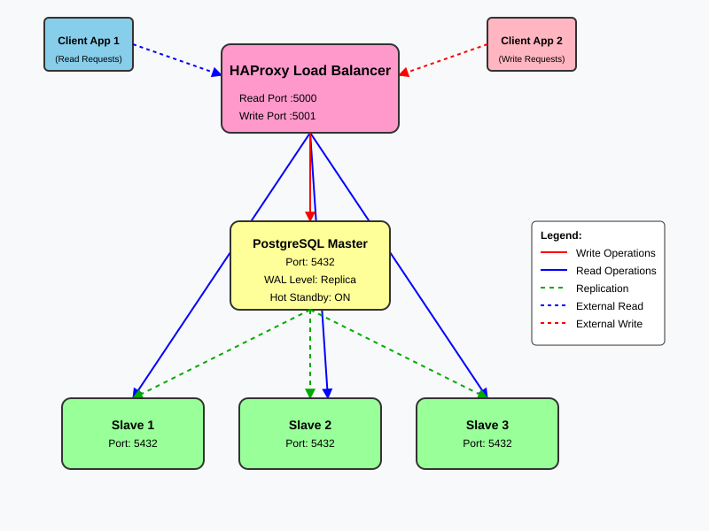

# PostgreSQL Master-Slave Replication with HAProxy Load Balancer

This project demonstrates a robust PostgreSQL master-slave replication setup using Docker containers, featuring one master node, three slave nodes, and HAProxy for intelligent read/write request routing.

## Architecture Overview



### Components
- 1 Master Node (Write Operations)
- 3 Slave Nodes (Read Operations)
- HAProxy Load Balancer
  - Port 5000: Read Operations (Round-Robin)
  - Port 5001: Write Operations (Master Only)

### Port Mappings
- HAProxy Read Port: 5000 (routes to slaves)
- HAProxy Write Port: 5001 (routes to master)
- Master Node: Internal port 5432
- Slave Nodes: Internal port 5432

## Features

- One master and three slave nodes
- HAProxy load balancing with TCP health checks
- Streaming replication with WAL archiving
- Automatic read/write split routing
- Health monitoring for all nodes
- Comprehensive test suite
- Environment-based configuration

## Prerequisites

- Docker Engine (version 20.10.0 or higher)
- Docker Compose (version 2.0.0 or higher)
- At least 4GB of available RAM
- 10GB of free disk space

## Quick Start

1. Clone the repository:
   ```bash
   git clone git@github.com:sachin/master_slave_replication_for_postgres.git
   cd master_slave_replication_for_postgres
   ```

2. Review and modify the `.env` file if needed:
   ```bash
   # Default credentials
   POSTGRES_USER=myuser
   POSTGRES_PASSWORD=mypassword
   POSTGRES_DB=mydb
   ```

3. Start the containers:
   ```bash
   docker compose up -d
   ```

4. Verify the setup:
   ```bash
   # Check replication status on master
   docker exec -it pg_master psql -U myuser -d mydb -c "SELECT * FROM pg_stat_replication;"
   
   # Test write access through HAProxy
   psql -h localhost -p 5001 -U myuser -d mydb
   
   # Test read access through HAProxy
   psql -h localhost -p 5000 -U myuser -d mydb
   ```

## Configuration

### HAProxy Configuration

HAProxy is configured with two frontends:

1. **Read Operations (Port 5000)**
   - Round-robin load balancing across slave nodes
   - TCP health checks every 5 seconds
   - Automatic failover if a slave becomes unavailable

2. **Write Operations (Port 5001)**
   - Direct routing to master node
   - TCP health checks every 5 seconds
   - No failover (master only)

Key HAProxy settings:
- Max connections: 100
- Client timeout: 30 minutes
- Server timeout: 30 minutes
- Connect timeout: 4 seconds
- Check interval: 5 seconds

### PostgreSQL Replication Settings

The master node is configured with the following replication settings in init-master.sh:

- **listen_addresses = '*'**: Allows connections from any IP address
- **wal_level = replica**: Enables WAL (Write-Ahead Logging) at a level suitable for replication
- **max_wal_senders = 10**: Maximum number of concurrent connections for WAL streaming
- **wal_keep_size = 64MB**: Amount of WAL files to retain for replication
- **hot_standby = on**: Allows read-only queries on slave nodes during recovery
- **max_replication_slots = 10**: Maximum number of replication slots for managing WAL retention
- **synchronous_commit = on**: Ensures WAL is written to disk before transactions complete
- **max_connections = 100**: Maximum number of concurrent database connections
- **shared_buffers = 128MB**: Amount of memory used for shared memory buffers

### Environment Variables

All configuration is managed through the `.env` file:

- **PostgreSQL Common Configuration**
  - `POSTGRES_USER`: Database user (default: myuser)
  - `POSTGRES_PASSWORD`: Database password (default: mypassword)
  - `POSTGRES_DB`: Database name (default: mydb)
  - `POSTGRES_INITDB_ARGS`: Additional initialization arguments
  - `POSTGRES_HOST_AUTH_METHOD`: Authentication method

- **Master Node Configuration**
  - `MASTER_PORT`: Master node port (default: 5532)
  - `WAL_LEVEL`: WAL level (default: replica)
  - `MAX_WAL_SENDERS`: Maximum WAL sender processes
  - `WAL_KEEP_SIZE`: WAL retention size
  - `HOT_STANDBY`: Hot standby mode
  - `MAX_REPLICATION_SLOTS`: Maximum replication slots

- **Slave Nodes Configuration**
  - `SLAVE1_PORT`: Slave 1 port (default: 5533)
  - `SLAVE2_PORT`: Slave 2 port (default: 5534)
  - `SLAVE3_PORT`: Slave 3 port (default: 5535)

### Network Configuration
- `PG_NETWORK`: Docker network name (default: pg_network)

## Testing

A comprehensive test suite is included to verify the replication setup:

1. Run the test script:
   ```bash
   ./test/test_replication.sh
   ```

The test suite performs the following checks:
1. Verifies master and slave nodes are running
2. Creates a test table on master
3. Verifies replication on slaves
4. Confirms read-only status on slaves
5. Tests data consistency across nodes
6. Validates HAProxy read/write routing

## Monitoring

### Health Checks

All nodes include health monitoring:
- Interval: 10s
- Timeout: 5s
- Retries: 5
- Start period: 30s

### HAProxy Statistics

Monitor HAProxy status:
```bash
# Check HAProxy stats
docker exec -it haproxy haproxy -c "show stat"
```

### Replication Status

Monitor replication status:
```bash
# On master
docker exec -it pg_master psql -U myuser -d mydb -c "SELECT * FROM pg_stat_replication;"

# On slaves
docker exec -it pg_slave1 psql -U myuser -d mydb -c "SELECT * FROM pg_stat_wal_receiver;"
```

## Troubleshooting

### Common Issues

1. **Containers fail to start**
   - Check logs: `docker compose logs`
   - Verify port availability (5000, 5001, 5432)
   - Ensure sufficient system resources

2. **Replication not working**
   - Check master logs: `docker compose logs master`
   - Verify slave logs: `docker compose logs slave1`
   - Confirm network connectivity
   - Check HAProxy logs: `docker compose logs haproxy`

3. **Performance issues**
   - Monitor resource usage
   - Check WAL archiving status
   - Verify network latency
   - Monitor HAProxy connection stats

4. **Connection issues**
   - Verify HAProxy is running: `docker ps | grep haproxy`
   - Check HAProxy logs for connection errors
   - Confirm PostgreSQL nodes are healthy
   - Test direct connection to nodes bypassing HAProxy

### Maintenance

1. **Cleanup**
   ```bash
   # Stop and remove containers, volumes
   docker compose down -v
   rm -rf pg_*
   ```

2. **Backup**
   ```bash
   # Create backup from master
   docker exec pg_master pg_dumpall -U myuser > backup.sql
   ```

3. **HAProxy Configuration Reload**
   ```bash
   # Reload HAProxy without downtime
   docker exec haproxy haproxy -f /usr/local/etc/haproxy/haproxy.cfg -sf $(pidof haproxy)
   ```

## License

This project is licensed under the MIT License - see the LICENSE file for details.

## Contributing

Contributions are welcome! Please feel free to submit a Pull Request.